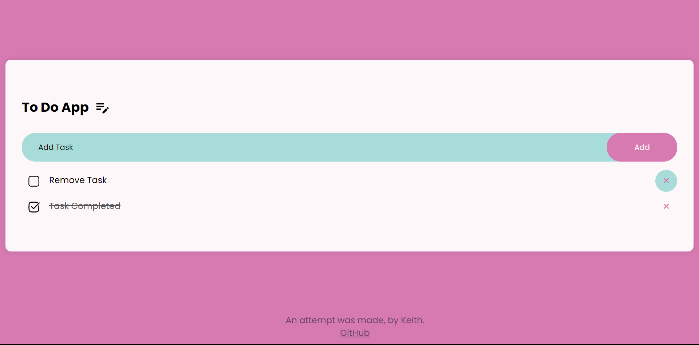
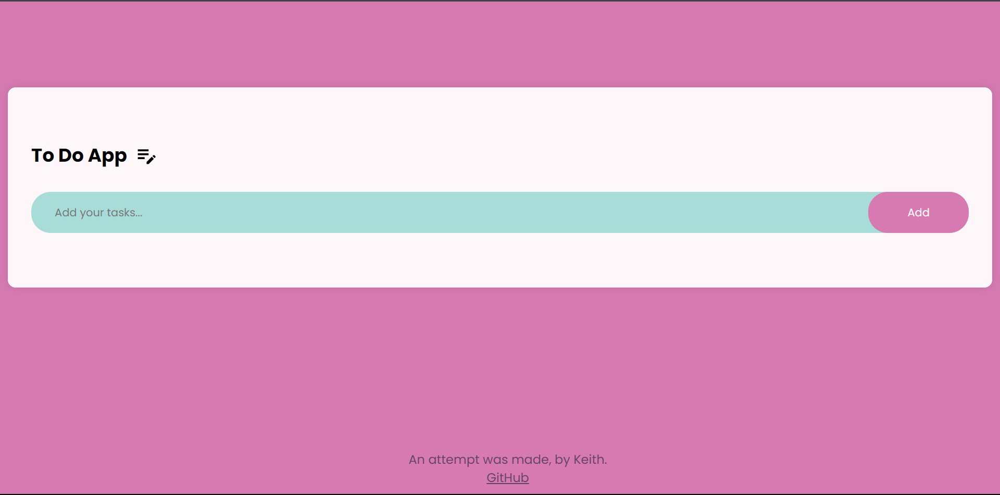

## Hi, I am attempting to make a to-do-app using HTML, JS and CSS. 

## This is the final look of the 'app'. It has functionality to add, remove and mark a task completed. 

## PS: THE APP IS NOT RESPONSIVE, IT MAY NOT WORK WELL IN DIFFERENT SCREEN SIZES.
